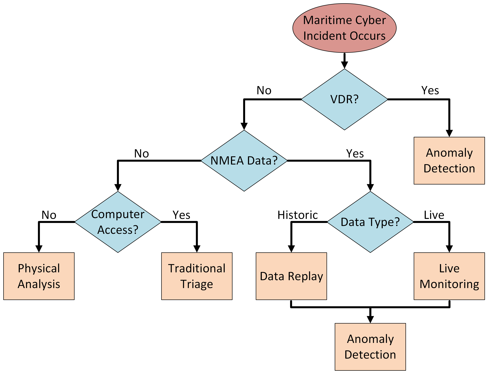

# Forensic Analysis of Maritime Cyber Incidents
## Table of Contents
### Background
- [Voyage Data Recorder Background](/Background/VDR)
- [NMEA Background](/Background/NMEA  )
- [Triage Background](/Background/Triage)

### Methodology
- [Proactive vs Reactive Analysis](/Methodology/README.md)
- [Voyage Data Recorder Methodology & Scripts](/Methodology/VDR)
- [NMEA Methodology & Scripts](/Methodology/NMEA)
- [Triage Methodology & Scripts](/Methodology/Triage)

### Tools
- [Raspberry Pi Forensic Computer](/Tools/Raspberry_Pi/)
- [FTK Imager](/Tools/FTK_Imager)
- [Autopsy](/Tools/Autopsy)
- [Miscellaneous Tools](/Tools/Data_Viewers/)

## Decision Tree

### Data Hierarchy
The importance of data is:
1. Voyage Data Recorder
2. NMEA-2000
3. Computer Triage
4. Physical Analysis

_It is important that each step in the analysis occurs with all data types. The Flow Chart is designed to assist investigators during initial inquiries into a vessel._

# Contributions
This Commercial Vessel Incident Response SOP was developed by 1/c Matthew Condon, 1/c James Kang, 1/c Cassandra Moshy, and 1/c Ryan Von Weihe during the 2025-2026 USCGA academic year.

The capstone advisor was LT DeValk-Hammond.
